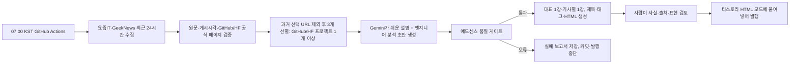

# Tistory Newsroom

매일 오전 07시(KST)에 **요즘IT·GeekNews의 최근 24시간 AI 모델·에이전트·오픈소스 기사**를 검증하고, **검토 가능한 티스토리 HTML 초안**으로 재구성하는 GitHub Actions 프로젝트입니다. 자동 발행은 하지 않습니다. 티스토리의 공식 글 작성 Open API가 종료되어 있고, 뉴스의 무단 재게시·무검토 자동 발행은 품질과 정책 측면에서 적절하지 않기 때문입니다.

두 참고 프로젝트의 장점만 결합했습니다.

| 참고한 강점 | 이 프로젝트 반영 |
| --- | --- |
| `ai-weekly-newsroom` | 다중 소스 수집, 선택된 과거 기사 URL 중복 방지, 일자별 원천 데이터 보관, AI 구조화, GitHub Actions 일일 실행, 실패 재시도 |
| `blog-writing` | 제목·태그·본문 HTML 분리, 복사 전용 검토 페이지, 날짜별 단일 초안 경로 재사용, 사람 검토 후 티스토리 게시 |

## 작동 흐름



## 최초 설정

1. Python 3.11 이상을 준비하고, 프로젝트 전용 환경에 의존성을 설치합니다.

   ```bash
   python3 -m venv .venv
   source .venv/bin/activate
   python -m pip install -e .
   ```

2. 설정 파일을 복사하고 실제 정보로 채웁니다.

   ```bash
   cp config/site.example.json config/site.json
   ```

   `author_name`, `author_bio`, `contact_email`, `blog_url`은 실제 값이 아니면 실사용 실행이 품질 게이트에서 중단됩니다. `draft_assets_base_url`에는 `https://GITHUB_ID.github.io/REPOSITORY/tistory/assets`처럼 GitHub Pages의 실제 이미지 주소를 넣습니다. 티스토리에 붙여넣은 4장 이미지가 이 주소를 사용합니다.

3. [Google AI Studio](https://aistudio.google.com/)에서 Gemini API 키를 발급합니다.
4. GitHub 저장소의 **Settings → Secrets and variables → Actions**에서 `GEMINI_API_KEY`를 추가합니다. 로컬에서는 `.env`에만 저장하세요.
5. GitHub Pages를 `GitHub Actions` 배포 원본으로 설정하면 `docs/`의 복사 페이지를 볼 수 있습니다.
6. Actions 탭에서 **Daily Tistory newsroom draft**를 한 번 수동 실행합니다.

로컬에서 API 키 없이 화면을 확인하려면:

```bash
make demo DATE=2026-07-11
open docs/index.html
```

실제 수집·초안 생성:

```bash
export GEMINI_API_KEY='발급받은-키'
make run
```

## 생성 파일과 발행 절차

날짜마다 아래의 **고정 경로 한 세트만** 생성됩니다. 같은 날짜의 예약 실행·수동 재실행은 이미 품질 통과한 초안을 그대로 반환하므로, Gemini 호출이나 `-2` 같은 추가 초안 파일을 만들지 않습니다. 오류로 중단된 날짜만 같은 경로에서 다시 시도합니다.

```text
data/runs/YYYY-MM-DD/collection.json       # RSS 원천 후보 및 선택 결과
data/runs/YYYY-MM-DD/draft.json            # AI가 반환한 구조화된 초안
data/runs/YYYY-MM-DD/quality-report.json   # 품질/정책 게이트 결과
docs/tistory/YYYY-MM-DD.html               # 티스토리 HTML 모드용 본문
docs/tistory/YYYY-MM-DD.json               # 제목 후보·태그·검토 정보
docs/tistory/assets/YYYY-MM-DD/             # 본문용 대표 이미지 1장과 이슈별 이미지(최대 3장)
docs/index.html                             # 복사 전용 검토 페이지
docs/adsense-checklist.html                 # 애드센스 준비 체크리스트
```

과거 날짜의 `collection.json`에서 실제로 **선택된** 항목의 원문 URL·GeekNews 소개 URL·GitHub/Hugging Face 공식 URL을 읽어 다음 수집의 선별 대상에서 제외합니다. 같은 발표를 다른 매체가 소개한 경우에도 공식 프로젝트 URL이 같으면 중복으로 처리합니다. 이미 통과한 날짜의 내용을 의도적으로 다시 만들 때만 아래처럼 같은 고정 파일을 덮어씁니다.

```bash
make run DATE=2026-07-11 REFRESH=1
```

선택 URL은 `data/history/seen-url-keys.json`에 계속 보관합니다. 상세 초안·이미지·수집 기록은 기본 180일 보관 후 정리하므로 Pages와 작업 디렉터리는 커지지 않지만, 오래된 기사 URL도 다시 선택하지 않습니다. 보존 기간은 `config/sources.json`의 `selection.detail_retention_days`에서 조정하며 `0`이면 자동 정리를 끕니다.

1. 복사 페이지에서 날짜를 고릅니다. 기본 `HTML` 탭에는 티스토리에 바로 붙여넣을 수 있는 실제 본문 소스가 표시되고, `View` 탭에는 같은 소스의 렌더링 결과가 표시됩니다. `본문 대표 이미지 다운로드`를 누르면 본문 맨 위에 표시되는 제목 텍스트 포함 PNG 파일을 받을 수 있습니다.
2. `View`에서 이미지·본문·원문 링크를 확인한 뒤, `HTML` 탭의 **본문 HTML 복사**를 누릅니다. 티스토리 글쓰기에서 제목/태그를 입력하고 **HTML 모드**에 본문을 붙여넣습니다.
3. 모든 원문 링크, 사실, 분석의 정확성, 문체, 내부 링크를 검토합니다.
4. `content/tistory-pages/`의 소개·편집정책·개인정보처리방침·문의 템플릿을 티스토리 페이지로 작성합니다. 연락처와 작성자 정보는 실제 값으로 바꾸세요.
5. 최종적으로 사람의 판단으로 발행합니다.

검토 페이지의 **원문 재생성** 버튼은 선택한 날짜의 고정 초안을 다시 작성합니다. 정적 GitHub Pages에는 실행 권한을 보관하지 않으므로, 실행할 때만 해당 저장소에 `Actions: Read and write` 권한을 준 GitHub fine-grained PAT를 입력해야 합니다. 토큰은 GitHub API 요청과 실행 상태 확인에만 쓰고 브라우저 저장소에 보관하지 않습니다.

## 애드센스 준비 원칙

이 프로젝트는 아래를 **자동 차단/검토 항목**으로 둡니다.

- 요즘IT·GeekNews에서 최근 24시간 이내에 실제 페이지로 확인한 기사만 수집
- 요즘IT·GeekNews 기사만으로 3건이 안 되면 최근 14일 GitHub/Hugging Face 커뮤니티의 활성 프로젝트로 보완해 3건 구성
- 매일 GitHub 또는 Hugging Face 커뮤니티에서 최근 관심을 받은 공식 프로젝트 1건 이상 필수
- 모델·에이전트·컴퓨터 비전·오픈소스·개발 도구·온디바이스/가속기 중심의 관련성 필터
- 각 이슈의 쉬운 설명, 확인된 기술 정보, 엔지니어 관점, 검증 메모, 원문 링크
- 기사 3건마다 대표 이미지 1장과 기사별 이미지 3장을 만듦
- 원문 복사·단순 치환을 막는 재구성 프롬프트와 출처 보관
- 자동 생성 글의 무검토 게시 금지(`manual_review_required: true`)
- 제목·태그 중복, 짧은 본문, 출처 누락, 금지 주제·광고 클릭 유도 문구 검사
- 광고 페이지와 무관한 빈 페이지에 광고를 넣지 않도록 안내
- 소개/문의/개인정보/편집 원칙 템플릿 및 `ads.txt.example` 제공

Google은 타사 글을 논평·선별·부가 가치 없이 복사·재작성한 화면과, 수동 검토·선별 없는 자동 생성 콘텐츠에 광고 게재를 허용하지 않습니다. 따라서 단순 뉴스 요약을 대량 발행하지 않고, 모든 초안을 사람 검토 단계에 멈춥니다. 정책은 수시로 바뀌므로 발행 전 [Google 게시자 정책](https://support.google.com/adsense/answer/10008391?hl=ko)과 [복제 콘텐츠 정책](https://support.google.com/publisherpolicies/answer/11190248?hl=ko)을 다시 확인하세요.

> 자동 검사는 정책 준수와 애드센스 승인을 보장하지 않습니다. 최종 판단은 Google과 게시자에게 있으며, 저작권·개인정보·사실성도 직접 검토해야 합니다.

## 필요한 키와 토큰

필수 API 키는 `GEMINI_API_KEY` 하나입니다. GitHub Actions는 자동 제공되는 `GITHUB_TOKEN`을 GitHub API 수집의 레이트리밋 완화에만 사용하므로 별도 발급이 필요 없습니다. 티스토리 로그인 토큰·Gmail API·OAuth 토큰은 사용하지 않습니다. 애드센스 승인을 받은 뒤에는 자신의 `ca-pub-...` 게시자 ID로 `ads.txt.example`을 `ads.txt`로 바꿔 **티스토리 실제 도메인 루트**에 배치하세요. GitHub Actions의 예약 작업은 07:00 KST에 요청되지만, GitHub 대기열에 따라 실제 시작 시각은 늦어질 수 있습니다.

## 테스트

```bash
make test
```
